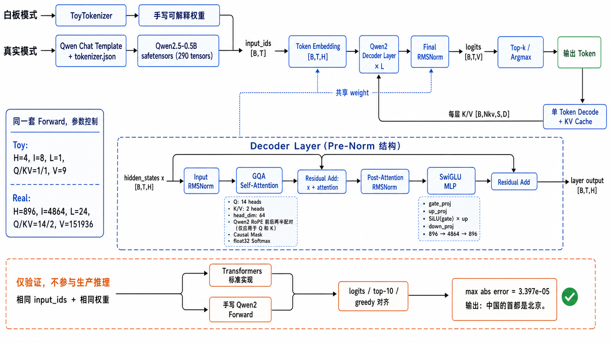

# Infer-DaseSS：手写 Qwen2.5 推理器

本项目实现了一个与 Qwen2.5-0.5B-Instruct **结构同构**的最小推理系统。模型的
Embedding、RMSNorm、Q/K/V、Qwen2 RoPE、GQA、causal attention、SwiGLU、残差、
Final RMSNorm、LM Head、KV Cache、prefill 和 greedy decode 均由仓库代码完成；
生产推理不调用 Hugging Face 模型 forward 或 `model.generate()`。

同一套 forward 支持两类参数：

- 可解释的白板 toy 权重：参数直接写在仓库中，用于逐层教学和单元测试。
- Qwen2.5-0.5B-Instruct 真实权重：从服务器外部 checkpoint 加载，用于正确性对齐和 benchmark。

当前 Phase 2 使用 FP16、SDPA、左填充变长 batch 和 KV Cache。在 A800 80GB 上运行
完整公开 benchmark 的分数为 **86.03 / 100**。完整环境、命令、分项指标和运行历史见
[benchmark-results.md](docs/benchmark-results.md)。

## 系统架构



```text
prompt
  │
  ▼
Qwen tokenizer + chat template
  │ input_ids / attention_mask / position_ids
  ▼
Embedding
  ▼
N × Decoder Layer
  ├─ RMSNorm → Q/K/V → Qwen2 RoPE → causal GQA → O projection → residual
  └─ RMSNorm → SwiGLU MLP                              → residual
  ▼
Final RMSNorm → LM Head → logits → greedy token
                       ▲
                       └─ per-layer KV Cache for decode
```

白板与真实模型由同一个 `QwenToyConfig` 控制，关键结构参数如下：

| 参数 | 白板 toy | Qwen2.5-0.5B-Instruct |
| --- | ---: | ---: |
| vocabulary | 9 | 151936 |
| hidden / intermediate | 4 / 8 | 896 / 4864 |
| decoder layers | 1 | 24 |
| query heads / KV heads | 1 / 1 | 14 / 2 |
| head dimension | 4 | 64 |
| maximum positions | 64 | 32768 |
| RoPE theta | 1,000,000 | 1,000,000 |
| tied embeddings | no | yes |

真实值由 checkpoint 的 `config.json` 读取；`configs/qwen2_5_0_5b.json` 是仓库内的结构参考，
不是第二份权重。

推理有两条可切换的 attention 路径：

- `eager`：显式计算 attention scores，便于查看 shape 和数值，是可解释参考实现。
- `sdpa`：调用 PyTorch scaled dot-product attention 内核，用于真实 batch 和 benchmark。

两条路径共享权重、RoPE、mask 和 KV Cache，并通过测试及 Transformers oracle 对齐。
批量生成对不同长度 prompt 左填充，每行使用独立的逻辑 position IDs；prefill 只将末位置
hidden state 投影到词表。若共享服务器发生真实 CUDA OOM，`StudentEngine` 会二分当前
chunk 重试，单请求仍 OOM 时保留原始异常。

## 仓库结构

| 路径 | 职责 |
| --- | --- |
| `toy_qwen/modeling.py` | Qwen2 Decoder、RMSNorm、RoPE、GQA、SwiGLU、LM Head |
| `toy_qwen/generation.py` | 单条/批量 greedy decode、左填充、KV Cache |
| `toy_qwen/pretrained.py` | 真实 config/safetensors 校验与加载 |
| `toy_qwen/weights.py` | 可解释白板 toy 权重 |
| `student_release/student_engine.py` | 公开 benchmark 的统一适配入口 |
| `verification/compare_transformers.py` | 可选 Transformers float32 数值 oracle |
| `whiteboard_llm_inference.py` | 白板 toy 模型入口 |
| `real_qwen_inference.py` | 真实权重的可解释单条推理入口 |
| `tests/` | primitive、逐层、cache、batch、loader 和 adapter 测试 |
| `configs/` | 白板与 Qwen2.5-0.5B 结构配置 |
| `docs/benchmark-results.md` | 版本化实验环境、分数、分析和优化方向 |

架构设计和开发计划保存在 `docs/superpowers/specs/` 与 `docs/superpowers/plans/`。

## 权重与路径约定

真实模型权重**不提交到本仓库**。每台实验服务器都要单独准备一个 checkpoint 目录，至少包含：

```text
Qwen2.5-0.5B-Instruct/
├── config.json
├── model.safetensors
├── tokenizer.json
└── tokenizer_config.json
```

当前服务器的路径只是示例：

```text
/ai/llm/models/models/Qwen/Qwen2.5-0.5B-Instruct
```

换服务器时不修改源码，只设置以下变量：

```bash
export PROJECT_ROOT=/path/to/Infer-DaseSS
export MODEL_PATH=/path/to/Qwen2.5-0.5B-Instruct
export PYTHON_BIN="$PROJECT_ROOT/.venv-real/bin/python"
```

检查路径：

```bash
test -f "$PROJECT_ROOT/toy_qwen/modeling.py"
test -f "$MODEL_PATH/config.json"
test -f "$MODEL_PATH/model.safetensors"
test -f "$MODEL_PATH/tokenizer.json"
test -f "$MODEL_PATH/tokenizer_config.json"
```

## 环境依赖

推荐 Python 3.11。PyTorch 应按服务器 CUDA/驱动安装；课程服务器可以复用预装 PyTorch：

```bash
cd "$PROJECT_ROOT"
python3.11 -m venv --system-site-packages .venv-real
"$PROJECT_ROOT/.venv-real/bin/pip" install -r requirements-real.txt
export PYTHON_BIN="$PROJECT_ROOT/.venv-real/bin/python"
```

依赖分层：

| 场景 | 依赖 |
| --- | --- |
| 白板 toy 推理/测试 | PyTorch |
| 真实权重生产推理 | `requirements-real.txt`：safetensors、tokenizers |
| Transformers 数值 oracle | `requirements-verify.txt`，仅用于验证 |
| 公开 benchmark | `student_release/requirements.txt` 和可用的 CUDA PyTorch |

`transformers` 不进入生产模型 forward；验证脚本中的 oracle 是唯一允许使用
`AutoModelForCausalLM` 的隔离路径。

## 运行白板 toy 模型

```bash
cd "$PROJECT_ROOT"
"$PYTHON_BIN" whiteboard_llm_inference.py \
  --prompt 中国首都是 \
  --trace-shapes
```

预期末行：

```text
next token: 北
```

这里的“北”由可解释 toy 权重经过完整 forward 得到，不是规则或硬编码输出。

## 运行真实权重

可解释单条推理入口默认使用 eager attention，支持打印 top-5 和 KV Cache shape：

```bash
cd "$PROJECT_ROOT"
"$PYTHON_BIN" real_qwen_inference.py \
  --model-path "$MODEL_PATH" \
  --prompt 中国的首都是哪里？ \
  --device cuda \
  --dtype bfloat16 \
  --max-new-tokens 16 \
  --trace-shapes
```

benchmark 运行路径通过 `StudentEngine` 使用 FP16 和 SDPA。运行真实接口检查：

```bash
cd "$PROJECT_ROOT"
"$PYTHON_BIN" student_release/scripts/validate_engine.py \
  --model "$MODEL_PATH" \
  --device cuda \
  --dtype float16 \
  --attn-implementation sdpa \
  --local-files-only
```

## 正确性验证

运行本地测试和静态规则检查：

```bash
cd "$PROJECT_ROOT"
"$PYTHON_BIN" -m unittest discover -s tests -v
"$PYTHON_BIN" student_release/scripts/validate_engine.py --skip-load
```

可选的真实权重 float32 oracle 会使用相同 input IDs，对比自研 SDPA 与 Transformers eager
的末位置完整 logits、top-10 和 greedy token：

```bash
cd "$PROJECT_ROOT"
"$PROJECT_ROOT/.venv-real/bin/pip" install -r requirements-verify.txt
"$PYTHON_BIN" verification/compare_transformers.py \
  --model-path "$MODEL_PATH" \
  --prompt 中国的首都是哪里？ \
  --device cuda \
  --attn-implementation sdpa \
  --tolerance 1e-3
```

当前真实模型对齐的最大绝对误差为 `3.50e-05`，top-10 顺序和 greedy token 完全一致。

## 运行公开 benchmark

先把缓存放在服务器可写目录：

```bash
export INFERENCE_OPT_CACHE_ROOT=/path/to/writable/cache
cd "$PROJECT_ROOT/student_release"
source use_data_cache.sh
```

单样本 smoke（只验证全链路，不作为正式分数）：

```bash
"$PYTHON_BIN" -u scripts/run_inference_benchmark.py \
  --model "$MODEL_PATH" \
  --local-files-only \
  --device cuda \
  --dtype float16 \
  --attn-implementation sdpa \
  --limit 1 \
  --baseline-summary data/public_baseline_summary.json \
  --allow-stale-baseline \
  --suite-isolation process \
  --worker-timeout-s 1800 \
  --output-dir results/smoke
```

完整公开配置（不传 `--limit`，保留默认 batch sizes 和 token budgets）：

```bash
"$PYTHON_BIN" -u scripts/run_inference_benchmark.py \
  --model "$MODEL_PATH" \
  --local-files-only \
  --device cuda \
  --dtype float16 \
  --attn-implementation sdpa \
  --timed-repeats 3 \
  --baseline-summary data/public_baseline_summary.json \
  --suite-isolation process \
  --worker-timeout-s 1800 \
  --output-dir results/phase2_full
```

正式运行会生成 `final_summary.json`、`final_summary.txt`、`student/summary.json` 和
`student/results.csv`。本项目的 accepted run、分项解释及后续优化方向见
[版本化 benchmark 记录](docs/benchmark-results.md)。

## 在不同服务器开发和运行

推荐流程是“本地/WSL 编辑并提交源码，GPU 服务器只保存 checkpoint、运行环境和实验结果”。

### 方式一：Git（推荐）

```bash
# 新服务器首次部署
git clone git@github.com:zyghhh/Infer-DaseSS.git "$PROJECT_ROOT"

# 后续同步
git -C "$PROJECT_ROOT" pull --ff-only
```

### 方式二：通过 SSH 发送当前 Git 快照

在本地/WSL 设置连接变量；不要把密码或私钥口令写进仓库：

```bash
export LOCAL_PROJECT=/mnt/d/vdesktop/infer-dasess
export SERVER_USER=root
export SERVER_HOST=server.example.com
export SERVER_PORT=22
export SSH_KEY="$HOME/.ssh/server_key.pem"
export REMOTE_PROJECT=/ai/projects/Infer-DaseSS
```

先在服务器创建目标目录，再只传输 Git 已跟踪文件：

```bash
ssh -p "$SERVER_PORT" -i "$SSH_KEY" \
  "$SERVER_USER@$SERVER_HOST" "mkdir -p '$REMOTE_PROJECT'"

git -C "$LOCAL_PROJECT" archive --format=tar HEAD | \
  ssh -p "$SERVER_PORT" -i "$SSH_KEY" \
  "$SERVER_USER@$SERVER_HOST" "tar -xf - -C '$REMOTE_PROJECT'"
```

`git archive` 不会传输 `.git`、虚拟环境、Python cache、未跟踪的 `references/`、ZIP 包或
本地 benchmark results。真实模型继续由远端 `MODEL_PATH` 指向，不随源码同步。

部署后只需重新设置服务器变量并执行验证：

```bash
export PROJECT_ROOT="$REMOTE_PROJECT"
export MODEL_PATH=/server-specific/path/Qwen2.5-0.5B-Instruct
export PYTHON_BIN="$PROJECT_ROOT/.venv-real/bin/python"
cd "$PROJECT_ROOT"
"$PYTHON_BIN" student_release/scripts/validate_engine.py --skip-load
```

## 当前边界与后续扩展

当前已实现 eager/SDPA、GQA、左填充 batch、固定步 greedy decode、KV Cache、末位置
LM Head 投影和 OOM chunk 降级。尚未实现的主要性能能力包括：

- 预分配或 paged KV Cache，减少 decode 期间反复拼接；
- `serve_requests`、continuous batching 和请求调度；
- shared-prefix KV 复用；
- 面向 padding mask 的 FlashAttention 路径和长度分桶；
- safetensors 分片、量化与多 GPU。

这些优化可在不改变当前 Qwen2 数学 forward 和 checkpoint 命名的情况下逐步加入。
